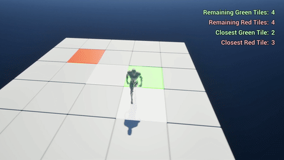

# TileMinigame

## Tile Gameplay

### Tile Grid Creation

A separate class (TilesGrid) was created for Grid creation and management for reasons of cleanliness and organization,
and which saw two different approaches.

The first in feature/tile-gameplay involved firstly spawning the various tiles, placing them in the surroundings of the
starting platform, considered as the central element (or at the center in the case of even-sided grids).

Then through a resized window on an auxiliary index vector, it was possible to instantiate in a randomly the various
Green or Red Tiles, satisfying the constraint of the desired number of Tiles of the respective color.

|  |
|:---------------------------------------------------------------------------------:|
|                               Tile Array Randomizer                               |

This choice was made because in the case of a large grid, it is possible to randomly extract an index to be assigned to
the desired tile, rarely incurring the need to repeat the extraction to ensure a single random result.
In small arrays, however, this approach can lead to serious problems, so this auxiliary array allows to simply solve the
situation.

In the second case, which is present in the final version, first the tiles of the various colors are spawned
sequentially, and finally the array is filled with the common tiles. After that, after transforming the central tile
into a Common Tile (swapping it with the last element), all the tiles except from the central one are shuffled.
Finally, the shuffled Tiles are moved to their respective position around the initial platform, as done previously.

|  |  |
|:---------------------------------------------------------------------------------:|:---------------------------------------------------------------------------------:|
|                          Grid with all Tiles turned 0ff                           |                           Grid with all Tiles turned 0n                           |

### Tile stepping on

Next, the mechanics of tile stepping was dealt with.

First of all, a Trace Channels was added for detecting tiles, which were equipped with a BoxComponent that handles
collision and queries.

To locate a possible tile, the player casts in each frame a raycast below itself along the newly created trace channel,
If the raycast hit something, it checks whether the new tile is different from the last stepped tile (if any); if it is
true it means that the player stepped on a new tile, calling the StepOff and StepOn methods on the respective tiles.
Also, if the new one had never been stepped on before, it increases the counter of green or red tiles collected for the
end of the game.

At the end it sets the new tile as the old tile and calculates the distance to the nearest green and red tiles,
according to the algorithm described next.

|  |  |
|:-----------------------------------------------------------------------------------:|:--------------------------------------------------------------------------------:|
|                     Green Tile step on, decreasing the counter                      |               Green Tile step off, staying with the current color                |

|  |  |
|:-----------------------------------------------------------------------------------:|:--------------------------------------------------------------------------------:|
|                      Red Tile step on, decreasing the counter                       |                Red Tile step off, staying with the current color                 |

|  |  |
|:------------------------------------------------------------------------------------:|:---------------------------------------------------------------------------------:|
|                    Blue Tile step on, showing all the green tile                     |              Blue Tile step off, hiding green tiles not yet pressed               |

### Closest Tile Algorithm

Searching for the nearest tile of a certain color is done when a new tile is pressed.

For this solution, I thought of two different algorithms.

The first involves storing the Red tiles (or their respective indexes) in one list and the Green ones in another list.
In this way it is possible to cycle through them all, and for each of them calculate the distance to the player's cell
according to the formula:

Given

- (X,Y) the player cell
- (i,j) the target cell

> d = abs(Delta R) + abs(Delta C)

with

- Delta R = X - i
- Delta C = Y - j

Finally, the minimum distance among those found is saved.

I decided to discard this solution because I had already
implemented the second one, which I preferred in case of a large number of Green and Red Tiles, and I would have had to
readjust the storing of the Tiles, but still this remains in my opinion a very valid approach

 

The algorithm used, however, is the diamond algorithm, i.e., the surroundings of the array are scanned at increasing
distances,, until the first tile of that color is found.

|  |
|:----------------------------------------------------------------------------------:|
|                                    Diamond scan                                    |

 

Once inheritance is added, the best strategy is probably the former approach, because the second approach would have had
to involve a not insignificant number of Casts to control the player's surroundings. However, using a hybrid approach,
which includes inheritance and enums for Green, Red, Blue and Common cells this issue is bypassed.

### End and Reset conditions

The game can end in 3 ways:

- Stepping on all the green cells
- Stepping on all the red cells
- Exiting the grid

In the first two cases, a check is made to see if the condition is reached in each frame. If this is the case, an
EndScreen is showed, disabling the player controller inputs as well, and through a 5-second timer the map is reloaded.

In the third case, on the other hand, a BoxComponent was created sufficiently extended below the grid that, in case of
overlap with the player, immediately restarts the game.

|  |
|:----------------------------------------------------------------------------------:|
|                        Box Trigger Component under the Grid                        |

## Tile Classes

Differentiation between the various Tiles was initially handled simply by an Enum. Later, as explained above, it was
chosen to implement a hybrid solution involving Enum and inheritance.

Classes ATileRed, ATileBlue, ATileGreen, and ATileCommon were created from the ATile class, each representing different
tiles, but all inheriting from the Tile class. This made it possible to overwrite the StepOn and StepOff methods to
provide each tile with its own mechanics once stepped on or off.